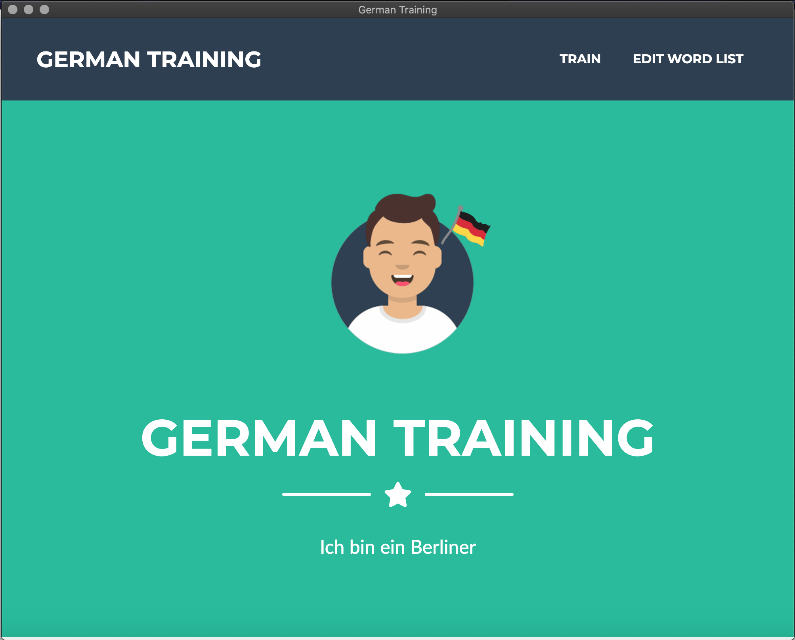
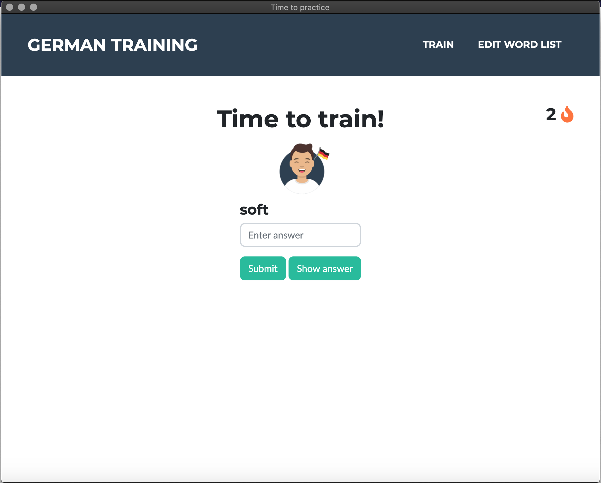
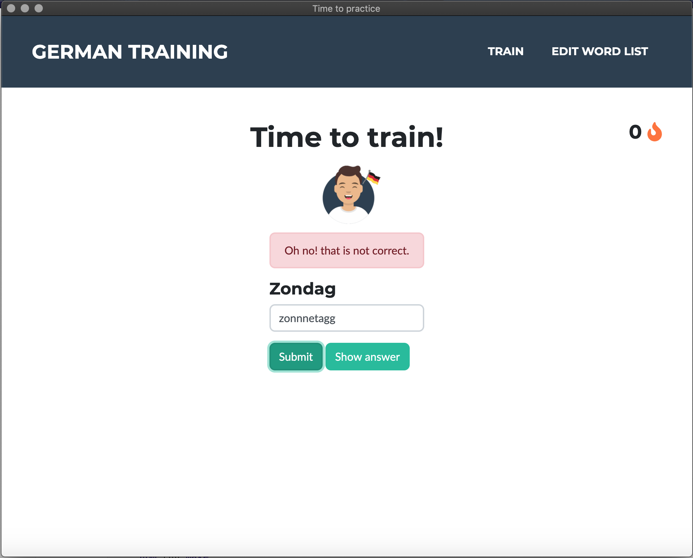
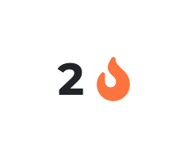
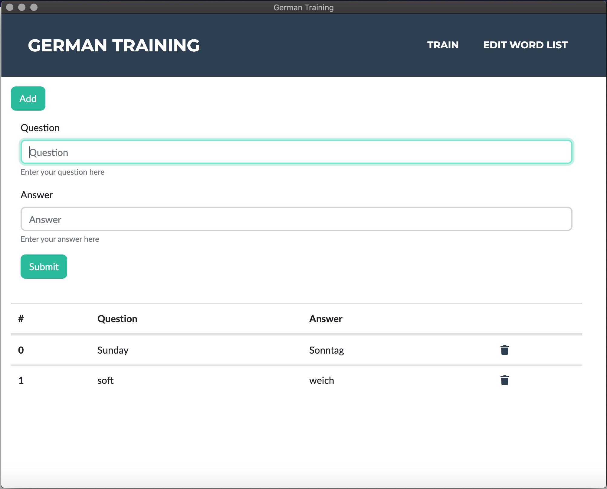

# german-training
An app to train my german vocabs, written in electron.js

Available for mac and windows: [click here](https://github.com/martijnmeeldijk/german-training/releases/tag/0.1.0)

Windows doesn't trust my app, so when you install it, you'll be greeted by a message telling you not to run it. Just click the `show more` button and click `run anyway` to continue.

## Features

The app has a lot of exciting features, and a lot more to come.

### Fun

The app will question you and give feedback. 








### Streaks

If you keep answering correctly, your streak will increase. But watch out, if you get a question wrong, your streak will reset.



### Custom word list

Add words to the list of words you'd like to learn. 




Notes to self:

Start app in dev:
```bash 
    npm start
```
Package and distribute:
```bash 
    npm run make
```
Package and distribute cross-platform:
```bash 
    npm run makex
```
Get dependencies:
```bash 
    npm install
```
